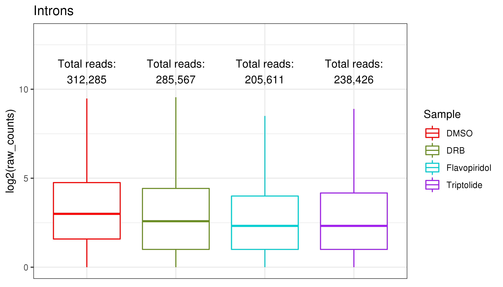
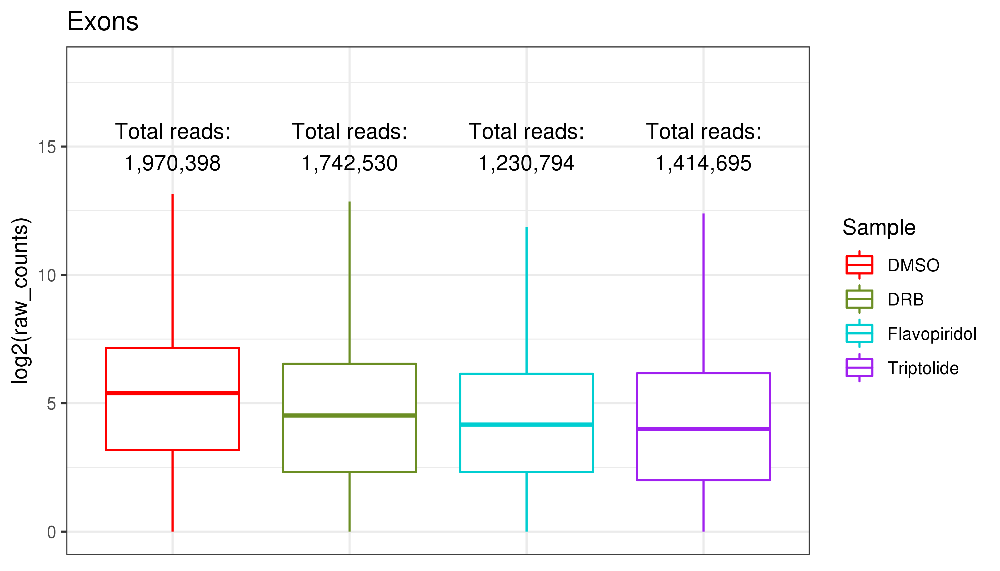
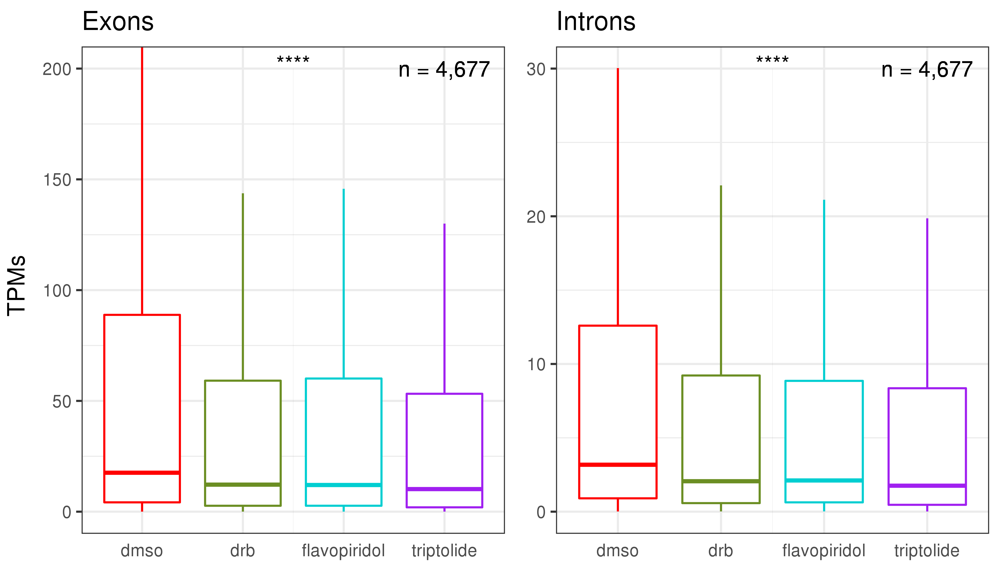

### Overview: 

The goal of this analysis is to calculate the introns TPMs for each of the four samples. 


### 1. Load and tidy intron data for analysis 

I use the intron count files for the four drugs (i.e. DMSO, DRB, Flavopiridol, and Triptolide) produced by the mapping in './map_introns.sh'.


```r
# get file names 
files = dir(path = './data/counts', pattern = 'introns.counts.txt', full.names = T)

# load files and concatenate counts 
intron_counts = c() 
for (i in seq_along(files)) {
  x = read.table(file = files[i], sep = '\t', header = F, as.is = T)
  intron_counts = cbind(intron_counts, x[, 2])
}

# set row names and column names 
intron_counts = as.data.frame(intron_counts)

rownames(intron_counts) = x[, 1]
colnames(intron_counts) = sub('./data/counts/s_', '', files)
colnames(intron_counts) = sub('_?\\d?.introns.counts.txt', '', colnames(intron_counts))

# remove rows that don't correspond to genes 
iv = grep('^AALF', rownames(intron_counts))
intron_counts = intron_counts[iv, ]

# temporarily make rownames a column and save as csv
intron_counts_temp = intron_counts %>%
  mutate(
    gene_ID = rownames(intron_counts), 
    .before = 1
  )
write.table(intron_counts_temp, './data/counts/intron_counts.csv', sep = ',', row.names = F, col.names = T, quote = F)
```

### 2. Calculate intron lengths per gene 

Now, I determine the total length of all introns per gene in order to calculate TPMs. 


```r
# define gff file path 
gff_file = './data/AaloF1.EnsGen_50.gff'

# make TxDb
txdb = makeTxDbFromGFF(file = gff_file)

# get introns by transcript and calculate total length per gene 
introns_by_tx = intronsByTranscript(txdb, use.names = TRUE)
intronsLength = sum(width(reduce(introns_by_tx)))

# convert lengths to kilobases 
intronsLength = intronsLength / 1000
```

### 3. Calculate TPMs 


```r
# match genes IDs to the intronLengths vector 
iv = match(rownames(intron_counts), names(intronsLength))

# calculate Reads Per Kilobase (RPK) by dividing each gene's counts by its intron length in kilobases 
intron_rpk = apply(intron_counts, 2, function(x) x / intronsLength[iv])
intron_rpk = as.data.frame(intron_rpk)

# calculate per million scaling factor of each sample as the sum of the RPK of the sample divided by 1 million 
scaling_factor = apply(intron_rpk, 2, function(x) sum(x) / 1000000)

# divide the RPK values by the scaling factor to get Transcripts Per Million (TPM)
intron_tpm = sapply(1:4, function(x) {
  intron_rpk[[x]] / scaling_factor[[x]]
})

# clean data.frame
intron_tpm = as.data.frame(intron_tpm) %>%
  mutate(
    rownames(intron_rpk), 
    .before = 1
  )
colnames(intron_tpm) = c('gene_ID', colnames(intron_rpk))
intron_tpm$gene_ID = sub('-RA', '', intron_tpm$gene_ID)

# save file 
write.table(intron_tpm, './data/tpms/intron_tpms.csv', sep = ',', col.names = T, row.names = F, quote = F)
```

### 4. Load exon and ercc data


```r
# load ercc counts 
ercc_counts = read.table('./data/counts/ercc_counts.csv', sep = ',', header = T)
colnames(ercc_counts) = c('ercc_ID', 'dmso', 'drb', 'flavopiridol', 'triptolide')

# load exon counts 
exon_counts = read.table('./data/counts/exon_counts.csv', sep = ',', header = T)
colnames(exon_counts) = c('gene_ID', 'dmso', 'drb', 'flavopiridol', 'triptolide')

# load exon tpms
exon_tpm = read.table('./data/tpms/exon_tpms.csv', sep = ',', header = T)
exon_tpm = exon_tpm[-2]
colnames(exon_tpm) = c('gene_ID', 'dmso', 'drb', 'flavopiridol', 'triptolide')
```

### 5. Visualize raw counts and TPMs 

I'll plot the raw intron counts per sample. 


```r
# melt intron reads
intron_counts_melted = reshape2::melt(intron_counts)
intron_counts_melted$value = log2(intron_counts_melted$value)

# get sum of all counts per sample
intron_counts_total = apply(intron_counts, 2, sum)

# set colors
cols = c('dmso' = 'red', 'drb' = 'olivedrab', 'flavopiridol' = 'darkturquoise', 'triptolide' = 'purple')

# plot intron raw counts
intron_raw_counts = intron_counts_melted %>%
  ggplot(aes(x = variable, y = value, color = variable)) +
  geom_boxplot(outlier.shape = NA, fill = 'white') +
  scale_color_manual(values = cols, labels = c('DMSO', 'DRB', 'Flavopiridol', 'Triptolide')) +
  annotate(geom = 'text', x = c(1, 2, 3, 4), y = 11, label = paste0('Total reads:\n', format(intron_counts_total, big.mark = ','))) +
  theme_bw() +
  theme(axis.text.x = element_blank(), 
        axis.title.x = element_blank(), 
        axis.ticks.x = element_blank()) +
  labs(
    color = 'Sample', 
    y = 'log2(raw_counts)', 
    title = 'Introns'
  )

intron_raw_counts
```

<!-- -->

There are less total intron reads in the drugs that aren't DMSO. Intron raw counts are lower in the drugs that aren't DMSO.

Now plot raw exon counts. 


```r
# plot exon raw counts 
exon_counts_melted = reshape2::melt(exon_counts)
exon_counts_melted$value = log2(exon_counts_melted$value)

exon_counts_total = apply(exon_counts[-1], 2, sum)

exon_raw_counts = exon_counts_melted %>%
  ggplot(aes(x = variable, y = value, color = variable)) +
  geom_boxplot(outlier.shape = NA, fill = 'white') +
  scale_color_manual(values = cols, labels = c('DMSO', 'DRB', 'Flavopiridol', 'Triptolide')) +
  annotate(geom = 'text', x = c(1, 2, 3, 4), y = 15, label = paste0('Total reads:\n', format(exon_counts_total, big.mark = ','))) +
  theme_bw() +
  theme(axis.text.x = element_blank(), 
        axis.title.x = element_blank(), 
        axis.ticks.x = element_blank()) +
  coord_cartesian(ylim = c(0, 18)) +
  labs(
    color = 'Sample', 
    y = 'log2(raw_counts)', 
    title = 'Exons'
  )

exon_raw_counts
```

<!-- -->

Exon raw counts are lower in the drugs that aren't DMSO. 

Now plot the raw ERCC counts. 


```r
# plot ERCC raw counts 
ercc_counts_melted = reshape2::melt(ercc_counts)
ercc_counts_melted$value = log2(ercc_counts_melted$value)

ercc_counts_total = apply(ercc_counts[-1], 2, sum)

ercc_raw_counts = ercc_counts_melted %>%
  ggplot(aes(x = variable, y = value, color = variable)) +
  geom_boxplot(outlier.shape = NA, fill = 'white') +
  scale_color_manual(values = cols, labels = c('DMSO', 'DRB', 'Flavopiridol', 'Triptolide')) +
  annotate(geom = 'text', x = c(1, 2, 3, 4), y = 22, label = paste0('Total reads:\n', format(ercc_counts_total, big.mark = ','))) +
  theme_bw() +
  theme(axis.text.x = element_blank(), 
        axis.title.x = element_blank(), 
        axis.ticks.x = element_blank()) +
  coord_cartesian(ylim = c(0, 25)) +
  labs(
    color = 'Sample', 
    y = 'log2(raw_counts)', 
    title = 'ERCC'
  )

ercc_raw_counts
```

<!-- -->

There are more ERCC counts in the drugs than in the DMSO sample. 

Now we can visualize the TPMs to see if transcription is really being blocked. 


```r
# merge the exon and intron TPM tables 
tpms = merge(exon_tpm, intron_tpm, by = 'gene_ID')

# change column names 
colnames(tpms) = sub('x$', 'exon', colnames(tpms))
colnames(tpms) = sub('y$', 'intron', colnames(tpms))

# remove genes that have less than 1 tpm for all exons and introns 
iv = apply(tpms[-1], 1, function(x) all(x) < 1)
tpms = tpms[!iv, ]

# melt the dataframe
tpms_melted = reshape2::melt(tpms, id = 'gene_ID')

# make column for exon or intron type
tpms_melted$type = ifelse(grepl('exon', tpms_melted$variable), 'exon', 'intron')
tpms_melted$variable = sub('.exon', '', tpms_melted$variable)
tpms_melted$variable = sub('.intron', '', tpms_melted$variable)

# make column for control vs drug
tpms_melted$group = ifelse(tpms_melted$variable == 'dmso', 'control', 'drug')

# get p-value
sig = tpms_melted %>%
  group_by(type) %>%
  wilcox_test(value ~ group) %>%
  add_significance() 
sig$x = c(2.5, 2.5)
sig$xmin = c(2.5, 2.5)
sig$xmax = c(2.5, 2.5)

# get number of genes 
n = nrow(tpms)

# plot
tpms_plot = tpms_melted %>%
  ggplot(aes(x = variable, y = value, color = variable)) +
  geom_boxplot(outlier.shape = NA) +
  scale_color_manual(values = cols, labels = c('DMSO', 'DRB', 'Flavopiridol', 'Triptolide')) +
  facet_wrap(~ factor(type, levels = c('exon', 'intron')), scale = 'free_x') +
  theme_bw() +
  geom_text(label = paste0('n = ', format(n, big.mark = ',')), inherit.aes = F, x = 4, y = 200) +
  stat_pvalue_manual(data = sig, inherit.aes = F, y.position = 200) +
  coord_cartesian(ylim = c(0, 200)) +
  theme(axis.text.x = element_blank(), 
        axis.title.x = element_blank(), 
        axis.ticks.x = element_blank()) +
  labs(
    y = 'TPM', 
    color = 'Sample'
  )

tpms_plot
```

<!-- -->

P-value is between DMSO and the rest of the drugs. 
Both the exon expression and intron expression goes down for all three drugs. It appears transcription is being blocked. 


